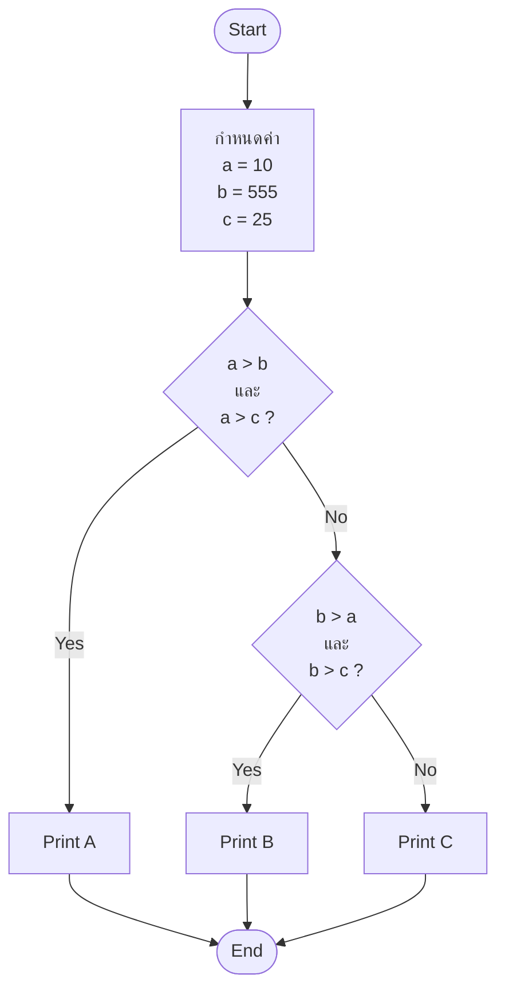

# Flowchart: เปรียบเทียบค่าตัวแปร a, b, และ c

## บทนำ

โปรแกรมนี้มีวัตถุประสงค์เพื่อเปรียบเทียบค่าของสามตัวแปร (`a`, `b`, และ `c`) โดยการตรวจสอบว่า **ตัวแปรใดมีค่ามากที่สุด** และทำการพิมพ์ชื่อของตัวแปรที่มีค่าสูงสุด (A, B, หรือ C) ตามลำดับ

## โครงสร้าง Flowchart

การทำงานของโปรแกรมสามารถแสดงเป็น Flowchart ดังนี้:



```java
public class Main {
    public static void main(String[] args) {
        // กำหนดค่าตัวแปร
        int a = 10;
        int b = 555;
        int c = 25;

        // เช็คว่า a เป็นค่ามากที่สุด
        if ((a > b) && (a > c)) {
            System.out.println("A");
        } else {
            // ถ้า a ไม่มากที่สุด เช็คว่า b เป็นค่ามากที่สุด
            if ((b > a) && (b > c)) {
                System.out.println("B");
            } else {
                // ถ้า b ก็ไม่มากที่สุด พิมพ์ C
                System.out.println("C");
            }
        }
    }
}
